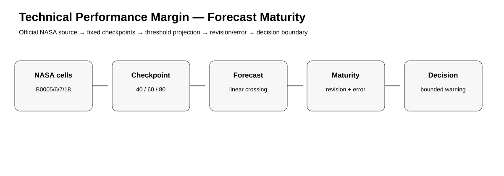
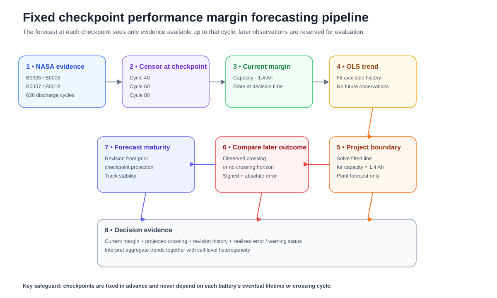
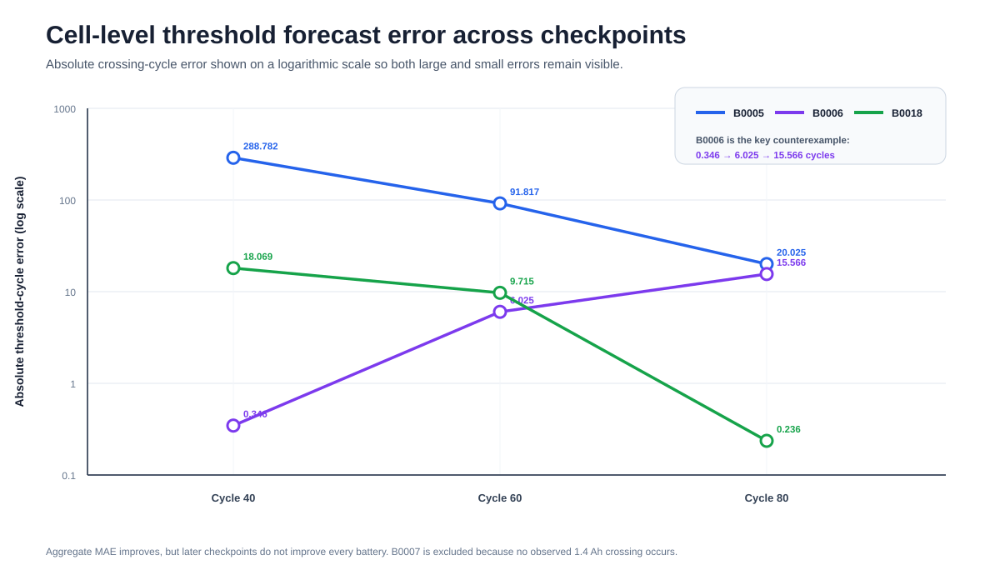
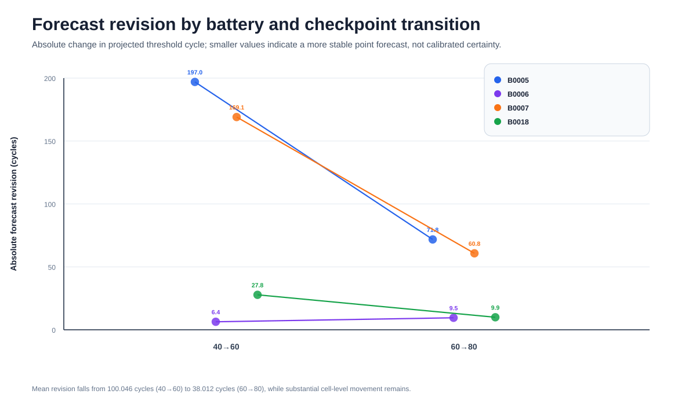
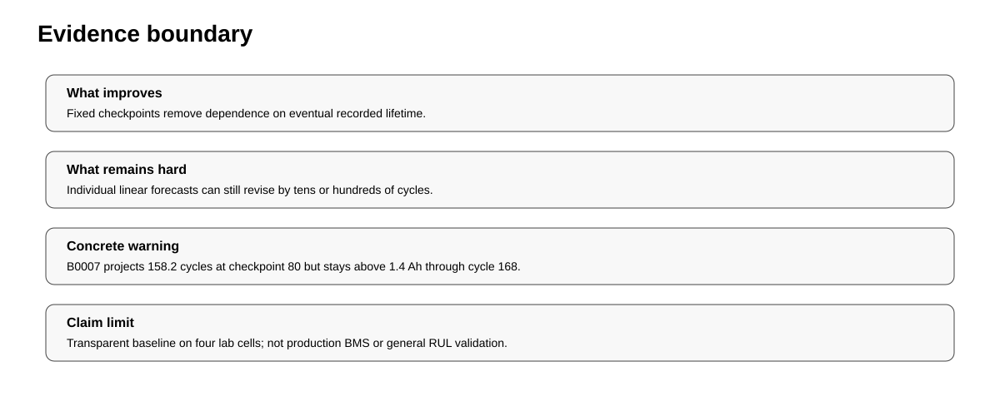

# Forecast Maturity of Technical Performance Margin on NASA Li-ion Battery Aging Data

[](https://github.com/devissaputra/technical_performance_margin_monitor/actions/workflows/ci.yml)
[](https://github.com/devissaputra/technical_performance_margin_monitor/actions/workflows/empirical-rebuild.yml)

> **System Engineering Research Package** · Engineering Management Research · Technical Performance Monitoring · Prognostics

This repository studies how a projected requirement crossing matures as evidence accumulates. Four NASA lithium ion battery trajectories are monitored at fixed 40, 60, and 80 cycle checkpoints. At every checkpoint, the forecast uses only capacity observations available at that point in time.



## Start here

- [Scientific report](REPORT.md)
- [Empirical study protocol](EMPIRICAL_STUDY.md)
- [Paper blueprint](docs/paper_blueprint.md)
- [Research design](docs/research_design.md)
- [Analysis plan](docs/analysis_plan.md)
- [Reproducibility guide](REPRODUCIBILITY.md)
- [Data provenance](data/README.md)
- [Final QA evidence](QA_REPORT.md)

## Research questions

1. How does projected 1.4 Ah threshold timing change at fixed 40, 60, and 80 cycle checkpoints?
2. Does aggregate threshold cycle error decrease as more evidence becomes available?
3. Is that improvement consistent across cells?
4. Can a projected threshold crossing become an actionable looking false warning?

## NASA source and threshold

NASA's Li-ion Battery Aging Datasets were collected at the Ames Prognostics Center of Excellence. NASA states that the experiments used an end of life criterion of 30% capacity fade, from 2.0 Ah rated capacity to 1.4 Ah.

Cells in this release:

- B0005
- B0006
- B0007
- B0018

Total packaged discharge observations: **636**.

## TPM style framing

NASA defines Technical Performance Measures as parameters monitored by comparing current achievement or best estimates with expected current and future values in order to identify risk to requirements.

This study applies that logic in a narrow laboratory setting:

```text
capacity margin = measured discharge capacity - 1.4 Ah
```

Capacity is treated as a performance parameter and the projected threshold cycle as forward looking decision evidence. This is not a claim that capacity alone is a complete system level TPM.

## Fixed checkpoint method

The earlier prototype used the first 60% of each cell's eventual history. That rule required knowing the future observation horizon.

The released analysis instead uses the same fixed checkpoints for every battery:

```text
cycle 40 → cycle 60 → cycle 80
```

At each checkpoint, ordinary least squares is fitted using only observations available up to that cycle:

```text
capacity = intercept + slope × discharge_cycle
```

If slope is negative, the line is solved for capacity = 1.4 Ah.



## Main results

| Checkpoint | MAE across crossing cells | Median absolute error | Mean forecast revision | False early warnings |
|---:|---:|---:|---:|---:|
| 40 | 102.399 | 18.069 | — | 0 |
| 60 | 35.852 | 9.715 | 100.046 | 0 |
| 80 | 11.942 | 15.566 | 38.012 | 1 |



The aggregate MAE falls substantially, but the improvement is not universal. B0006 moves from only 0.346 cycles of signed error at checkpoint 40 to an early error of 15.566 cycles at checkpoint 80. B0005, by contrast, improves dramatically from 288.782 cycles of error to 20.025 cycles.

That heterogeneity is why the study treats forecast maturity as something to monitor rather than assuming that later automatically means better.

## Forecast revision

B0005 illustrates large projection movement:

```text
413.782 → 216.817 → 145.025 cycles
```

Mean absolute forecast revision across all four cells falls from **100.046 cycles** for 40→60 to **38.012 cycles** for 60→80.



## False early warning case

B0007 never reaches 1.4 Ah within its 168 recorded discharge cycles.

At checkpoint 80, however, the linear trend projects a threshold crossing at **158.219 cycles**. Because that projection lies inside the observed horizon while no crossing occurs, the release flags it as a false early warning.

## What this study contributes

The contribution is not a new battery prognostics algorithm. It is a transparent systems engineering demonstration that monitoring should distinguish:

1. current margin to a requirement boundary;
2. projected timing of margin exhaustion;
3. revision of that projection as evidence accumulates;
4. realized forecast error or false warning behavior.

## Claim boundary

**Supported:** descriptive behavior of the transparent linear baseline on the four NASA cells, fixed checkpoint projections, revisions, cell level errors, aggregate errors, and the B0007 false warning.

**Not supported:** production BMS performance, calibrated uncertainty, cross chemistry generalization, superiority to modern prognostics, or a complete system level TPM implementation.



## Reproduce

Offline:

```bash
python -m pip install -r requirements.txt
pytest -q
python run_demo.py
python scripts/generate_figures.py
```

Official NASA source rebuild:

```bash
python scripts/fetch_and_analyze.py --check
```

The rebuild validates the release pinned NASA archive hash and reconstructs all four battery capacity series and checkpoint forecasts directly from the official archive.

## Repository map

- `REPORT.md`: scientific report
- `EMPIRICAL_STUDY.md`: released protocol and claim boundary
- `docs/paper_blueprint.md`: manuscript structure and draft abstract
- `docs/analysis_plan.md`: estimands and evaluation outputs
- `docs/research_design.md`: systems engineering design and inference scope
- `docs/data_dictionary.md`: derived data definitions
- `data/source_manifest.json`: canonical source and integrity policy
- `data/derived/cycle_capacity_evidence.csv`: complete 636 row capacity evidence
- `data/derived/checkpoint_results.csv`: all 12 checkpoint forecasts
- `data/derived/checkpoint_aggregate.csv`: aggregate forecast maturity metrics
- `research/model.py`: threshold projection and validation logic
- `scripts/`: NASA source rebuild and scientific figure generation
- `tests/`: scientific invariants and released result checks
- `QA_REPORT.md`: release consistency evidence

## Research integrity

The released fixed checkpoint protocol corrects a retrospective horizon dependent prototype. The change is documented openly and the revised design is not represented as preregistered.
