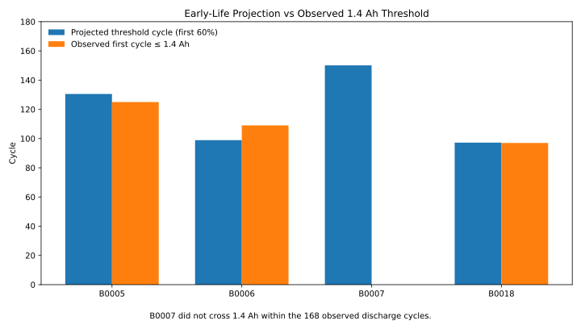

# Technical Performance Margin Monitoring on NASA Li-ion Battery Aging Data

> **Empirical Research Bundle** · **Portfolio Track: Engineering Management Research** · Systems Engineering / Technical Performance / Prognostics

Leakage-aware empirical threshold forecasting on NASA battery aging trajectories using only the first 60% of each cell history.


## Study status

**Completed secondary empirical analysis.** Reported findings were calculated from the named public source on 25 September 2026. The rebuild script contains **no synthetic fallback**. Raw source data are not republished unless source terms permit it; `data/source_manifest.json` records provenance, retrieval details, licensing notes, and the claim boundary.

## Research question

> How well can a transparent early-life capacity trend anticipate a 1.4 Ah end-of-life threshold without training on observations at or beyond that threshold?

## Design

- **Design:** Secondary prognostics analysis of laboratory battery aging time series
- **Source:** NASA Ames PCoE Li-ion Battery Aging Dataset (B0005, B0006, B0007, B0018)
- **Source page:** https://www.nasa.gov/intelligent-systems-division/discovery-and-systems-health/pcoe/pcoe-data-set-repository/
- **Direct data endpoint:** `https://raw.githubusercontent.com/amirhossein-sadeghi2003/battery-health-forecasting-baselines/e414d2e00ecc369d042637df6a6147a948718649/data/processed/discharge_capacity.csv`
- **Retrieval / analysis date:** 2026-09-25
- **Licensing / reuse note:** Primary NASA dataset is public. The convenience CSV is a transparent extraction of NASA MATLAB files; cite NASA/Saha & Goebel and the conversion source.

## Hypotheses

1. H1: an early-life linear capacity trend can provide a useful but imperfect threshold-crossing baseline.
2. H2: forecast error varies materially across cells, revealing trajectory heterogeneity that a single deterministic trend does not capture.
3. H3: a model may predict an early threshold crossing that the observed series does not realize, providing a concrete false-warning case.

## Empirical method

For each battery, use discharge capacity as the technical performance measure and define margin = capacity − 1.4 Ah. Fit ordinary least squares capacity versus discharge index using only the first 60% of that battery’s observed cycles, then project the 1.4 Ah crossing and compare it with the first observed crossing when one exists. The 60% cutoff keeps every observed crossing outside the training window.


## Headline empirical finding

Using only the first 60% of each history, the linear baseline is 5.5 cycles late for B0005, 10.1 cycles early for B0006, and 0.2 cycles late for B0018. For B0007 it predicts a crossing near cycle 150 even though observed capacity remains above 1.4 Ah through cycle 168, a false early threshold prediction.

### Headline metrics

- **n discharge cycles**: 636
- **eol threshold ah**: 1.4
- **b0005 observed eol cycle**: 125
- **b0005 projected eol cycle**: 130.5
- **b0006 observed eol cycle**: 109
- **b0006 projected eol cycle**: 98.9
- **b0018 observed eol cycle**: 97
- **b0018 projected eol cycle**: 97.2
- **training fraction**: 0.6
- **b0005 projection error cycles**: 5.5
- **b0006 projection error cycles**: -10.1
- **b0018 projection error cycles**: 0.2
- **b0007 projected eol cycle**: 150.1
- **b0007 observed eol cycle**: None

The packaged derived tables are documented in `docs/data_dictionary.md`. That document states explicitly whether each CSV is a complete analysis table or a diagnostic subset.



## What this study can and cannot claim

**Can claim:** the computations in this repository summarize the named public dataset under the documented operationalization.

**Cannot claim:** This is a transparent prognostics baseline, not a validated production health-management model. The processed CSV is a convenience derivative of the NASA source. B0007 demonstrates that a projected crossing inside the observed horizon need not actually occur; projection is not observation.


## Reproduce

Offline verification of packaged empirical results:

```bash
python -m pip install -r requirements.txt
pytest -q
python run_demo.py
```

Recompute the empirical analysis from the public source (internet required):

```bash
python scripts/fetch_and_analyze.py
```

The online rebuild calls study-specific functions from `research/model.py`; the tests exercise those functions and scientific invariants rather than only checking file presence.

## Research bundle contents

- `README.md` — study overview and bounded findings
- `EMPIRICAL_STUDY.md` — protocol, validity, and interpretation
- `data/source_manifest.json` — provenance, license note, and claim boundary
- `data/derived/` — compact derived empirical tables
- `results/empirical_summary.json` — machine-readable headline results
- `scripts/fetch_and_analyze.py` — public-source rebuild
- `research/model.py` — reusable study-specific analysis functions
- `tests/` — behavioral and scientific-invariant tests
- `docs/` — analysis plan, data dictionary, paper blueprint, references, originality map
- `assets/` — four study-specific SVG figures

## Research integrity

This bundle distinguishes **source data**, **operationalization**, **result**, and **interpretation**. The analysis plan documents the released analysis; it is **not described as preregistered**. Public data do not automatically validate a construct, so proxy and external-validity limits are explicit.
